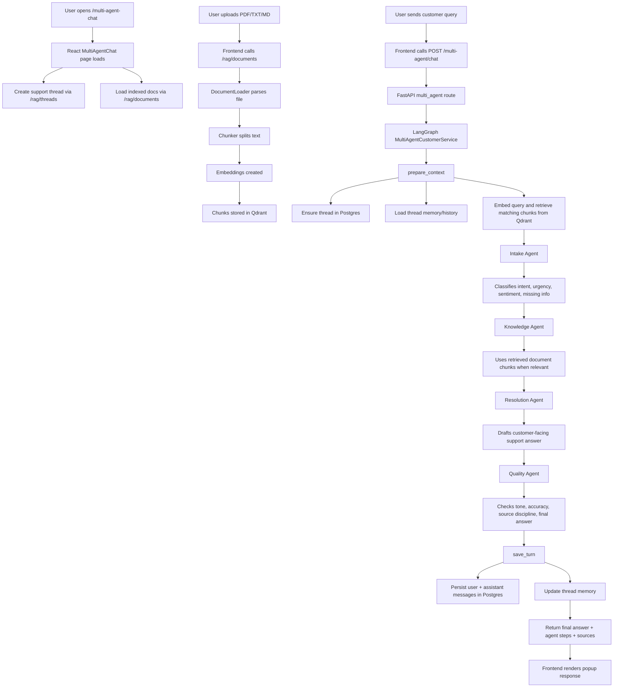

```mermaid
flowchart TD
  A["User opens /multi-agent-chat"] --> B["React MultiAgentChat page loads"]
  B --> C["Create support thread via /rag/threads"]
  B --> D["Load indexed docs via /rag/documents"]

  E["User uploads PDF/TXT/MD"] --> F["Frontend calls /rag/documents"]
  F --> G["DocumentLoader parses file"]
  G --> H["Chunker splits text"]
  H --> I["Embeddings created"]
  I --> J["Chunks stored in Qdrant"]

  K["User sends customer query"] --> L["Frontend calls POST /multi-agent/chat"]
  L --> M["FastAPI multi_agent route"]
  M --> N["LangGraph MultiAgentCustomerService"]

  N --> O["prepare_context"]
  O --> P["Ensure thread in Postgres"]
  O --> Q["Load thread memory/history"]
  O --> R["Embed query and retrieve matching chunks from Qdrant"]

  R --> S["Intake Agent"]
  S --> T["Classifies intent, urgency, sentiment, missing info"]

  T --> U["Knowledge Agent"]
  U --> V["Uses retrieved document chunks when relevant"]

  V --> W["Resolution Agent"]
  W --> X["Drafts customer-facing support answer"]

  X --> Y["Quality Agent"]
  Y --> Z["Checks tone, accuracy, source discipline, final answer"]

  Z --> AA["save_turn"]
  AA --> AB["Persist user + assistant messages in Postgres"]
  AA --> AC["Update thread memory"]

  AC --> AD["Return final answer + agent steps + sources"]
  AD --> AE["Frontend renders popup response"]

```